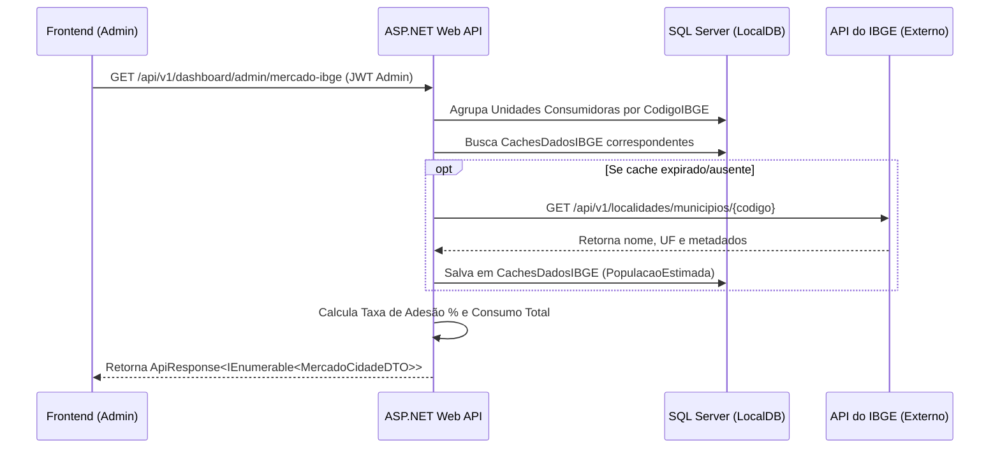

# 📋 Plano de Implementação — Análise de Adesão Regional (IBGE) para Admin

Este plano descreve a implementação da nova funcionalidade que permite ao perfil **Administrador** visualizar a taxa de adesão da plataforma nas cidades atendidas, cruzando o número de unidades ativas com os dados de população da API do IBGE.

O plano foi dividido em **2 etapas consecutivas**:
1. **Etapa 1: Backend (API, DTOs, Serviços e Autorização)**
2. **Etapa 2: Frontend (Roteamento, Componentes, Recharts e Telas)**

---

## 🗺️ Fluxo de Integração



---

## 🛠️ Etapa 1: Desenvolvimento do Backend (API)

Esta etapa foca na criação dos contratos (DTOs), na lógica de agrupamento e cálculo de adesão, no consumo da API do IBGE e na proteção do endpoint para administradores.

### 1.1. Contrato e DTO de Resposta
Criar o DTO `MercadoCidadeResponseDTO` no arquivo `GreenEnergy.API/Models/DTOs/IbgeDTOs.cs`:

```csharp
public class MercadoCidadeResponseDTO
{
    public string CodigoIBGE { get; set; } = null!;
    public string Cidade { get; set; } = null!;
    public string Estado { get; set; } = null!;
    public int PopulacaoEstimada { get; set; }
    public int QuantidadeUnidades { get; set; }
    public double TaxaAdesaoPercentual { get; set; }
    public double ConsumoTotalKWh { get; set; }
}
```

### 1.2. Interface e Lógica de Negócio (`IbgeService`)
1. Atualizar a interface `IIbgeService` para declarar o novo método:
   ```csharp
   Task<ApiResponse<IEnumerable<MercadoCidadeResponseDTO>>> ObterDadosMercadoAdminAsync();
   ```
2. Implementar a lógica em `IbgeService.cs`:
   * Buscar todas as `UnidadesConsumidoras` ativas (`IsActive = true`, `IsDeleted = false`).
   * Incluir os dispositivos e o histórico de telemetrias.
   * Agrupar as unidades por `CodigoIBGE`, `Cidade` e `Estado`.
   * Para cada grupo:
     * Contar a quantidade de unidades consumidoras.
     * Somar o `ConsumoKWh` total registrado nas telemetrias.
     * Buscar no banco a `PopulacaoEstimada` salva na tabela `CachesDadosIBGE`. Se não estiver presente ou estiver expirada (> 24h), fazer uma chamada HTTP à API oficial do IBGE (`/api/v1/localidades/municipios/{codigo}`) para atualizar o cache.
     * Calcular: $\text{TaxaAdesaoPercentual} = (\text{QuantidadeUnidades} / \text{PopulacaoEstimada}) \times 100$.
   * Retornar a lista ordenada decrescentemente pela taxa de adesão.

### 1.3. Endpoint de Controle e Segurança
Adicionar o endpoint no controller `AdminDashboardController.cs`:

```csharp
/// <summary>
/// Obtém dados demográficos e taxa de adesão por município (Apenas Admin).
/// </summary>
[HttpGet("mercado-ibge")]
[Authorize(Roles = "Admin")]
[ProducesResponseType(typeof(ApiResponse<IEnumerable<MercadoCidadeResponseDTO>>), StatusCodes.Status200OK)]
public async Task<IActionResult> GetMercadoIbge()
{
    var result = await _ibgeService.ObterDadosMercadoAdminAsync();
    return Ok(result);
}
```

### 1.4. Testes do Backend (xUnit)
Criar testes de integração em `GreenEnergy.Tests` para validar:
* **Bloqueio de acesso:** Clientes e Operadores que tentarem chamar o endpoint devem receber `403 Forbidden`.
* **Cálculo correto:** Administradores devem receber a lista ordenada com os dados demográficos e taxa de adesão devidamente calculada.

---

## 🎨 Etapa 2: Desenvolvimento do Frontend (Interface)

Esta etapa foca na construção das rotas, do layout da Sidebar, do consumo do novo endpoint do backend e da interface visual do painel do Administrador.

### 2.1. Navegação e Roteamento
1. Adicionar o link na barra lateral no componente `GreenEnergy.Frontend/src/components/layout/Sidebar.tsx` na seção restrita ao Administrador:
   ```tsx
   { to: '/admin/mercado', label: 'Penetração de Mercado', icon: <Compass size={20} /> }
   ```
2. Mapear o componente em `routes.tsx`:
   ```tsx
   { path: 'admin/mercado', element: <AdminMercadoIbge /> }
   ```

### 2.2. Tela de Visualização (`AdminMercadoIbge.tsx`)
Criar o arquivo `src/pages/admin/AdminMercadoIbge.tsx` contemplando:

1. **Indicadores Rápidos (Cards):**
   * **Cidades Ativas:** Quantidade total de cidades monitoradas.
   * **Total de Habitantes sob Cobertura:** Soma de todas as populações das cidades ativas.
   * **Maior Penetração:** Nome da cidade com a maior taxa percentual de adesão.
2. **Gráfico Recharts (`BarChart`):**
   * Mostrar de forma visual o Top 5 cidades com maior taxa de adesão.
3. **Tabela de Detalhes:**
   * Colunas: Cidade / UF, População da Cidade, Unidades Ativas, Consumo Acumulado (kWh), Taxa de Adesão (%).
   * A taxa de adesão deve possuir um indicador gráfico visual (como uma badge colorida ou barra de progresso horizontal em tons de verde e amarelo).
4. **Resiliência e UX:**
   * Usar componentes de carregamento do tipo `Skeleton` enquanto a requisição HTTP é feita.
   * Prover um `EmptyState` se não houver unidades no sistema ou se a API retornar dados em branco.
   * Envolver os gráficos e a tabela em um `ErrorBoundary` para evitar falhas totais na tela.
